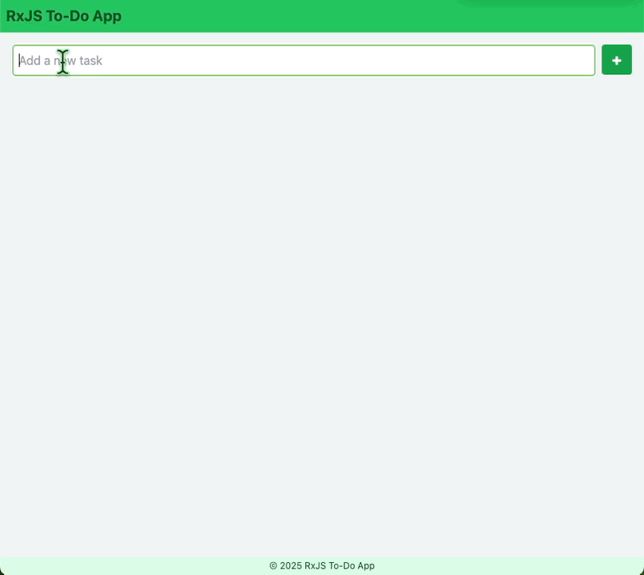

### RxJS To-Do App

#### Demo



#### How-Tos

##### Clone the repository

``
git clone https://github.com/movapages/yb-to-do-app
``


##### Install Dependencies

``
npm i
``


##### Run the SPA

``
npm run
``


##### Run the SPA tests

``
npm test
``


##### Lint SPA source code

``
npm run lint
``


#### The project's directory tree
```
.
├── LICENSE
├── README.md
├── eslint.config.js
├── jest.config.cjs
├── jest.setup.ts
├── package-lock.json
├── package.json
├── postcss.config.cjs
├── public
│   └── index.html
├── src
│   ├── App.tsx
│   ├── components
│   │   ├── Footer.test.tsx
│   │   ├── Footer.tsx
│   │   ├── Header.test.tsx
│   │   ├── Header.tsx
│   │   ├── MainArea.test.tsx
│   │   ├── MainArea.tsx
│   │   ├── TodoInput.test.tsx
│   │   ├── TodoInput.tsx
│   │   ├── TodoItem.tsx
│   │   ├── TodoList.test.tsx
│   │   └── TodoList.tsx
│   ├── index.tsx
│   ├── state
│   │   ├── todos.test.ts
│   │   └── todos.ts
│   ├── styles
│   │   └── global.css
│   └── types
│       └── todo.ts
├── tailwind.config.js
├── to-do-app.gif
├── tsconfig.json
└── webpack.config.cjs
```

#### The Project Toolkit and NPMs Used

1. **React v.19 <small>react.dev</small>**
   the version is picked out of curiosity, mostly, and to check its compatibility with other things (webpack, jest, eslint, etc.)
2. **RxJS v.7**
    it's a very reliable and flexible replacement for anything a history of React SPA state management may offer in this regard.
3. **TailwindCSS v.3** <small>(tailwindcss, postcss, autoprefixer)</small>
    a UI library which is different: it's flexible, extendable and well-tested.
4. **Webpack v.5** <small>(webpack, webpack-cli, webpack-dev-server)</small>
    it may be overkill for such a tiny project, but we must get ready, mustn't we?
5. **Typescript v.5**
    a static typing became, de facto, a standard in the industry...
6. **Jest v.29** a testing library and (parallel) test runner - handy, reliable, well-known.
7. **ESLint v.9** it helps to keep everything in order: enforce coding standards, catch errors early, etc.

#### SOLID Principles Employed <small>source code examples</small>

1. **Single Responsibility Principle (SRP)**
Each component in the SPA is responsible for one thing only.

2. **Open/Closed Principle (OCP)**
A component like `TodoList` is _open_ for its feature/functionality extension w/o modification its existing code.

3. **Liskov Substitution Principle (LSP)**
An injectable data service `todos` may be seamlessly replaced with a different state management library/solution,
while the rest of SPA functionality will remain intact.

4. **Interface Segragation Principle (ISP)**
The data service `todos`, its public API exposes the necessary methods - `addTodo`, `toggleTodo`, `removeTodo` - only.

5. **Dependency Inversion Principle (DIP)**
All components depend on `todos` service abstraction to manage their state, where applicable, but not on its implementation.
